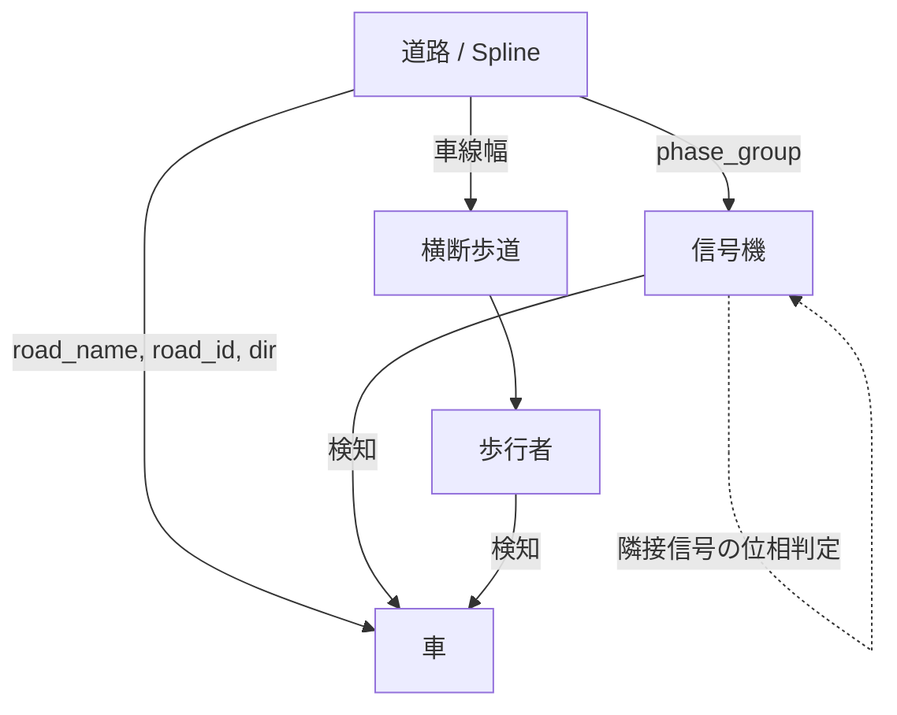

この記事では、Houdiniの中で実装した交通システムを、どのように構築したのかを解説していきます。

## 1. 概要

このプロジェクトの狙いは、ユーザーが道路のベースとなるライン群を入力するだけで、道路・車・信号・歩行者のすべてが自動生成され、破綻なく動くシステムを作ることでした。外部データ（OSM等）には未対応で、現時点ではHoudini内で完結する構成としています。

ただしこれは第一段階と位置づけていて、将来的にはOSMなどの実データを取り込んだ展開や、デジタルツインとしての応用も考えています。

#### AIの使用について

このプロジェクトでは、VEXのコードを書く部分でAIを使用しています。

Claudeなどに聞けばVEXは書いてくれますが、今回の場合は1つのVEXで完結しているわけではなく、複数の要素が相互作用しているため、ある程度VEXを読め、それぞれの処理を理解しておく必要があると感じました。また、HoudiniのGUIを理解できるのは今のところMCP経由のみで、ここまで複雑になると指示を出すこと自体が大変なうえ、安定性も低くなります。そのため、全体の設計とそれぞれの処理はこちらで考え、VEXはAIに書いてもらう——というのが、本プロジェクトでは最適解かなと感じました。

とはいえ、単純に面倒な部分だけAIに任せたらこうなった、という後付けでもあるのですが。

## 2. 要素分解

初めに、このシステムを大きく4つの要素に分解して考えました。

- 道路：車、信号機、歩行者すべての配置・挙動のベースとなる
- 車：道路のスプラインからデータを毎フレーム取得し、信号機や歩行者を検知しながら走行する
- 信号機：交差点や横断歩道の前に設置され、周期的に点灯を切り替える
- 歩行者：横断歩道を歩いて道路を横断する

このシステムは、これらの役割を持つ4つの要素の相互作用から成り立っています。

## 3. 全体の依存関係

システムを構成する4要素の依存関係は、次のようになります。

道路がすべての起点であり、そこから各要素へ情報が流れ込みます。車は信号機・歩行者を検知して振る舞いを変え、信号機どうしはphase_groupを介して隣接関係を判断する——という構造が、この図から見て取れます。

主要なattributeの説明 ・road_name ・road_id ・dir

これらがこのシステムにおいて、核となるアトリビュートになります。 言い換えれば、このシステムはattributeのやり取りが核となる設計といえます。

各道路は、別々の@road_nameを持っていて、同じ道路にある信号機や、同じ道路を歩く歩行者を検知する設計になっています。

## 4. 各要素の設計

各要素の設計を、中心となる道路・車（4.1）と、比較的シンプルな信号機・歩行者（4.2）に分けて掘り下げます。 その前に、

## 4.1 道路と車の設計

このシステムで一番、重要で難しかったのは、道路の生成と、それらの情報をもとに計算される車のアニメーションです。 ここでは、まず道路の生成方法について述べ、そのあと、道路のスプラインからどのようにして車のアニメーションが計算されているか述べようと思います。

### 道路

道路はすべてインプットされたラインをもとに、ラインの向きにかかわらず、左側通行の道路が生成されます。 また、車が沿って走るスプラインも同様に、インプットのラインから生成されています。
![[car_reads_point_attributes 1.png]]
以下に、生成プロセスのスナップを乗せます。 1 道路が欲しいところにカーブを生成します。 2 カーブからメッシュを生成します 3 カーブの交点から、道路の幅分と少し余裕を持たせた距離分、削除します　これで、カーブのベースとなるラインを生成します

交差点におけるカーブの自動生成 交点から片車線の道路の幅分と少し余裕を持たせた距離分、ラインのポイントを削除します。 これによって、車が曲がり始めるあたりからカーブを生成することができます。 そして、道路の進行方向と、交点からみた道路の進行方向を比べ、道路のラインをINとOUTの二つに分けます。下の図では、INからOUTへカーブを生成することで、車のアニメーションに適した、カーブが生成されます。

合流部分 各道路は、別々の@road_nameを持っていて、同じ道路にある信号機や、同じ道路を歩く歩行者を検知する設計になっています。

![[intersection_before_after (1) 1.png]]

ここで、先ほど説明した＠road_idが重要になってきます。 全体は共通の@road_name(ここでは、road_11とします)を持っていて、さらに、個別の@road_idを持っていて、同じ道路の中でも自分を区別することができます。 
![[Traffic System/_ARCHIVE/Road System/merge_point_zoom.png]] スプラインを入力に選んだのは、Houdiniで曲線を扱ううえで最も素直なプリミティブであり、ユーザーが直感的に道路網を描けること、そして曲線上の各点が進行方向（接線）や位置といった情報を自然に持つためです。この「点が持つ情報」は、Point Attributeとして、車のアニメーションでそのまま利用します。

多車線化や、それに伴う車線変更のロジックは、このシステムを拡張する際の課題です。

### 車

車は道路のスプラインの点から進行方向や車線情報などを取得して、アニメーションさせています。なので、言ってしまえば移動しているポイントにインスタンスしているような感じです。信号機や歩行者を検知した際の停止、および前方の車との距離保持については、〈要加筆：IDM（車間距離モデル）を用いた距離計算と、POP Solverとの連携について具体的に記述する〉。

最初にシステムを4つの要素へ分解し、それぞれの要件を定義するところまでは、比較的すんなり進みました。難しかったのは、その先——決めた要件を実際にHoudiniの枠組みの中で実装していく段階です。頭の中の設計を、ソフトの作法に沿った形に落とし込む作業には、想像以上にハードルがありました。

具体例で言うと、信号機のattribute設計はこの難しさの典型でした。最初は信号ごとに状態を持たせていましたが、交差点では隣接する信号への参照が複雑になり、そのままでは破綻しました。最終的に道路単位でattributeを管理する設計に変えたことで解決しました。

作業を進めるうちに見えてきたのが、4つの要素のあいだにある「複雑さの段差」です。道路と信号機は、比較的静的に決まります。道路はスプラインから一意に生成され、信号機も周期と位相のルールを決めてしまえば動きは定まります。一方で車と歩行者は、時間軸が絡んだ瞬間に複雑度が跳ね上がります。前の車との距離、信号や歩行者の検知、横断のタイミング——これらはすべて「その時々の状況」に応じて変化するため、静的に決め切ることができません。

同じ「1要素」として並べて要件定義した段階では気づきにくいのですが、静的に決まるものと、時間の流れの中で刻々と変わるものとでは、実装の難しさがまるで違います。この段差を体感できたことが、今回の設計上の一番の気づきでした。

## 4.2 信号機と歩行者

道路と車ほど込み入ってはいないので、ここでは信号機と歩行者の実装を軽く押さえておきます。

### 信号機

信号機は、青・黄・赤が周期的に点灯するVEXで実装しています。交差点での連動は、phase_groupを使って隣接する信号の位相をずらすことで実現しています。

### 歩行者

横断歩道は、道路のスプラインと車線幅に合うようにプロシージャルに配置しています。

最初は、道路幅のバウンディングボックスを作ってそこから横断歩道のサイズを割り出す、といった方法も考えていました。しかし実際に組んでみると、道路幅をコントロールしているパラメーターそのものを使って横断歩道の長さなどを決めた方が、圧倒的に楽だと気付きました。

ここで効いてくるのが、「なるべくベースのパラメーターでコントロールする」という考え方です。あるパラメーターから出力された結果を使って何かを制御するより、その根源にあるパラメーターで直接コントロールする方が、効率的で理にもかなっています。横断歩道の配置は、それを実感した場面でした。

歩行者は、その横断歩道の両端からランダムに生成されます。

## 5. Houdiniで実装することの意味

### 「好き」「慣れ」だけでツールを選ぶ危うさ

正直に言えば、今回Houdiniを選んだ理由の多くは主観的なものです。自分が3DCGを好んでいること、単純にHoudiniに使い慣れていること。ただ、これだけを理由にすると「3DCGこそ正しい手段だ」と思い込みがちで、本来ある他の選択肢——たとえばWebも十分に有力な選択肢です——を見落としてしまいます。だからこそ、「なぜこのツールを使う必要があるのか」を問い直すことが大事だと思っています。この問いを忘れると、自分としては満足でも、社会的には意味のない結果に終わってしまうことがあります。

### それでもHoudiniで作る理由

では今回、その問いに対する答えは何だったか。扱っているのが3Dのデータだから、です。3Dを扱ううえでは、HoudiniのようなDCCソフトウェアの方が明らかに優れています。手軽さでWebに譲る部分はあっても、「3Dデータをそのまま生み出せる」という一点で、Houdiniで作る必然性がある。個人の「好き・慣れ」から出発したとしても、最後にこの必然性へたどり着けたことが、今回このツールを選んだ本当の理由だと考えています。

3Dデータが具体的に何のために求められているのかは、次の「今後の展望」で改めて触れます。

## 6. 今後の展望

現状Houdini内で完結させているこのシステムには、まだいくつかの拾い残した部分があります。今後取り組みたいと考えているのが、大きく4つです。

**デジタルツインとしての展開** 今回3Dデータとして作ったことの意味は、この先の展開でより効いてくると考えています。都市計画・防災シミュレーション・自動運転の検証など、実世界を3D空間データとして扱う需要は近年急速に広がっており、Sony GroupのSpace DataやMaprayが手がけているデジタルツイン事業も、その延長線上にあります。道路・建物・車・人といった要素を、3D空間の中で破綻なく再現し、動かせるということ自体に、社会的な需要が生まれてきている。今回作った交通システムの自動生成も、その需要に応えうる部品の一つになりえると考えています。厳密には、実世界をデータで忠実に写し取るというデジタルツイン本来の目的とは、少し方向が違うかもしれません。それでも、静的な都市の3Dモデルに動きを与えていく一歩として位置づけています。

**OSMなどの外部データへの対応** 今回は道路のラインをユーザーが手で描くところから始めていますが、将来的にはOSM（OpenStreetMap）などの実データを読み込み、それをそのまま道路網の入力として使えるようにしたいと考えています。実現すれば、任意の実在する街をベースに、このシステムをそのまま走らせられるようになります。

**建物のディテールアップ** 現在このシステムは、道路・車・信号機・歩行者という「動くもの」に焦点を当てていて、建物についてはほとんど手をつけていません。デジタルツインとしての説得力を上げるには、建物側のディテール——たとえばプロシージャルな配置やボリュームの生成——も必要になってきます。

**歩行者の統合** 現状、横断歩道の生成と歩行者の生成は別々の仕組みとして動いています。横断歩道は道路のスプラインと車線幅からプロシージャルに配置され、歩行者はその両端からランダムに生成される、という構成です。この2つはいまのところ「横断歩道がある場所に歩行者を発生させる」という一方向の関係でしかつながっていません。本来はもっと一体化した仕組みとして、歩行者の発生・移動・信号との連動までを、1つのシステムの中で扱えるようにしたいと考えています。

## 7. 考察 —— AIをどう使い、どこを人間が担うか

最後に、今回の制作過程そのものについて少し振り返っておきます。

このシステムの中で、全体的な設計——各要素をどう連携させ、どう作用し合わせるか——は、自分で考えて決めています。VEXのコードについては、ベースをClaudeに書いてもらう場面が多くありましたが、それも「ここはこう連携させて、こう振る舞うようにしてほしい」という具体的な指示を自分から出したうえでのことで、実際にそれを組み上げ、動くところまで持っていく作業も自分で行いました。つまりAIが担ったのは、指示に沿ったコードのベースを速く出す部分であり、何をどう作るかという設計と、それを実装として成立させるところまでの作業は、最後まで自分の手の中にありました。

同じことは、attributeの設計にも言えます。road_idを信号ごとではなく道路単位で持たせる、という判断は、コードの前段にある設計思想そのものであり、要件を分解し、どこで詰まっているかを見極め、解決の方向性を決める作業でした。そもそも「なぜHoudiniで作るのか」という問いも同様です。ツールを選び、何を作るべきかを決めるという部分は、AIに書かせるコードの外側にある、人間の仕事だったと感じています。

つまり、今回の作業を通じて見えてきた役割分担は、「具体的な指示を出せば、それに沿ったコードのベースを速く出す」のがAIの仕事で、「何を、どう連携させ、どう振る舞わせるかを設計し、指示し、それを実装として組み上げる」のが人間の仕事だ、というものです。AIの実装力が上がるほど、後者——設計し、指示し、まとめ上げる力——の比重は、相対的に増していくのではないか。これが、今回の作業を通じての一番の実感です。